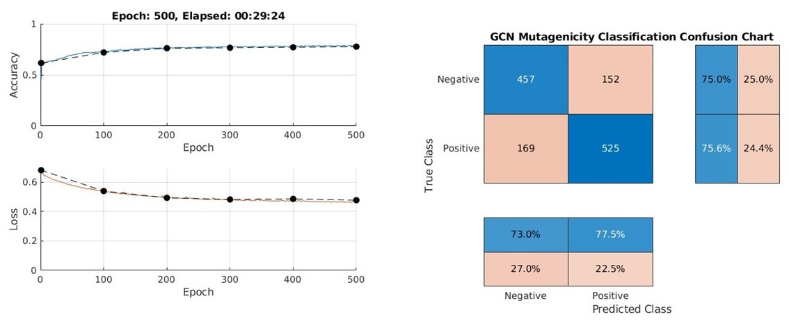

## Mutagenicity classification using graph convolutional neural networks 

The Ames test is a bacterial short-term test for identification of carcinogens using mutagenicity in bacteria as an end point. A high, but not complete, correlation has been found between carcinogenicity in animals and mutagenicity in the Ames test. The [Ames dataset](https://doc.ml.tu-berlin.de/toxbenchmark/) [2] used in this example, includes 6512 compounds and corresponding binary labels from Ames Mutagenicity results. The goal is to use graph convolutional network (GCN) to predict mutagenicity of given SMILES data as a binary classification task.

### RDKit Installation
RDKit can be installed easily by following the instructions from this [source](https://www.rdkit.org/docs/Install.html). Linux, Windows, and macOS RDKit platform wheels are available at the rdkit PyPi repository for all major Python versions. You can install RDKit using pip. 

>  $ pip install rdkit

Make sure to check versions of Python compatible with MATLAB products by release. This allows to build proper [MATLAB Interface to Python](https://www.mathworks.com/support/requirements/python-compatibility.html) 

The Python path is setup at the beginning of the MATLAB live script.
> pyenv("Version","C:\Users\...\python.exe");

### Usage

Simply move all MATLAB and Python functions to one folder, and run `MATLAB_Python_GCN_Classification.mlx`. You may use [Experiment Manager](https://www.mathworks.com/help/deeplearning/ref/experimentmanager-app.html) to optimize training parameters and network design. See this [video](https://www.mathworks.com/videos/how-to-set-up-your-own-deep-learning-experiments-1601541179542.html) to learn how to set up your deep learning experiments. The current set up should give a result like below:

### References
[1] RDKit: Open-source cheminformatics; http://www.rdkit.org

[2] K. Hansen, S. Mika, T. Schroeter, A. Sutter, A.T. Laak, T. Steger-Hartmann, N. Heinrich, K.R. Müller "Benchmark data set for in silico prediction of Ames mutagenicity", Journal of Chemical Information and Modeling 49, 2077 (2009).

